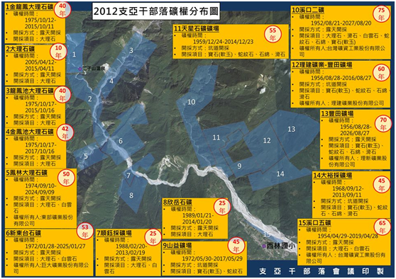

## COR Point 31 Rights of Indigenous Peoples

### Indigenous reservation land

<ol start="106">
  <li>
In the response to the Concluding Observations and Recommendations on the first State report (Paragraphs 92-96), the responses of the Council of Indigenous Peoples (CIP) and the Council of Agriculture (COA) were not sufficiently to the point. The dispute regarding the land for the Shihtiping Fishing Port in Fengpin Village in Hualien County was only one example of such a land dispute and not the single example. The concerned ministries should explain the following: the measures to protect rights during the window from the time of application for determination as indigenous reservation land through the time of approval and the disposition and remedial measures available if such land is expropriated or seized during that window.
</li>

  <li>
In the response, the CIP referred to “public property still to be added to indigenous reservation land” and stated that the competent authorities have already fulfilled their duty to restore indigenous peoples land rights. However, in fact, from the beginning of implementation of the “Program for the Supplemental Addition of Indigenous Reservation Land” in 2007 to 2014, only 9.2% of applications have successfully obtained land. The obstacles and challenges faced by indigenous people in the process of applying for supplemental land have sparked numerous disputes.39
</li>

  <li>
There are many contradictions in the process for applying for supplemental land for indigenous reservation land. Historically speaking, most indigenous tribal land had been violently seized and redistributed by the State during the Japanese colonial period. Beginning in late 1945, these lands were inherited by the ROC government or state enterprises. At present, when indigenous people apply to take back the land of their ancestors, they must themselves collect and submit all kinds of land-use evidence. Layers of review by the village government, the city or county government and the CIP follow until finally land management agency can express its opinion and decide whether to approve the application. However, when faced with the possibility of losing control over land in which they have had a long-term vested interest, the public asset management agencies often have antagonisms and contradictions with indigenous people or refuse to implement the procedure or even turn around and file legal action against the indigenous applicants themselves.40
</li>

  <li>
On one hand, the adoption by the government of Western concepts of property and its use of cadastral records as the only evidence to survey the land use of indigenous peoples when making dispositions of land passed on generation by generation from the ancestors of today’s indigenous peoples can easily trigger conflicts since the lack of recorded frameworks of land use make it difficult for indigenous people to prove their exclusive use rights or ownership of their land. On the other hand, since the intention of the policy is to restore the land to its original owner, why does the application process generate conflicts between the land management agencies and indigenous peoples? Moreover, when the CIP, as the competent authorities, encounters this kind of conflict, it does not have legally clear decision-making power, but can only constantly “coordinate” between the different sides. If the land management agency is unwilling to make any concessions, the CIP is essentially powerless.41
</li>

  <li>
The above-mentioned difficulties encountered by indigenous peoples in the process of applying to register indigenous reservation land have improperly abrogated the borders of exclusive use rights of indigenous peoples over reservation land and exposed the chronic problem of the discrimination against indigenous peoples’ traditions and customs by Han Chinese law. We recommend that:

    <ol>
      <li>
The procedure for applications to supplement indigenous peoples reservation land should be thoroughly reviewed and adjusted. Indigenous people should be able to obtain ownership if they can demonstrate the fact that they are actually engaged in the use and cultivation of land based on traditional knowledge.
</li>

      <li>
If indigenous reservation areas are found to have substantial utilization and are in accordance with related regulations, the Executive Yuan should carry out cross-ministerial consultations and directly retrieve the land in question from the land management agency and transfer it to the indigenous reservation area management agency (i.e., the Council of Indigenous Peoples). The CIP should then complete the procedure for allocation as indigenous reservation land in order to avoid indigenous peoples traditional lands from becoming the prize of a property war between vested interests. In addition, we advocate that the disposition powers of land management should be frozen during the period after an area of land has entered the application process to be designated as indigenous peoples reservation land and prior to the completion of the process as a means to preserve the integrity of the affected land during the window between application and approval.
</li>

      <li>
Finally, should the methods to resolve the land problems of indigenous peoples be restricted to only allowing individual indigenous persons obtain individual ownership of indigenous reservation land? The government should thoroughly reconsider this question and launch a wide-ranging dialogue with indigenous peoples to search for alternative ways to resolve land rights problems.
</li>
    </ol>
  </li>
</ol>

### Mining and Indigenous People’s Rights

<ol start="111">
  <li>
In the Response to the Concluding Observations and Recommendations to the First Review in the State Report (Paragraph 91), the definition of mining projects is restricted to land use applications for back-end mining operations. Nevertheless, during the state of the front-end determination of mining rights, the government does not plan to carry out advance notification or obtain the approval of affected indigenous peoples communities. In addition, the State Report only relates the situation regarding mining applications between 2012-2015 and did not mention how much indigenous peoples lands or communities have been affected by Taiwan’s 254 existing mines. The State report erroneously refers to Article 21 of the IPBL and maintains that the approval of the indigenous peoples competent agency, namely the CIP, should be solicited before the commencement of mining operations, but entirely ignores that the article in question mandates that “the government shall consult with indigenous peoples, tribes or indigenous people and obtain their consent.”
</li>

  <li>
From the content of the above-mentioned response in the State Report, it can be seen that the MOEA’s Bureau of Mines and the CIP have no idea of how many mines are sited on indigenous reservation land or traditional lands or the degree of impact on indigenous peoples and their communities. Neither the Bureau of Mines nor the CIP have paid attention to the impact of mining on the self-management of indigenous peoples lands and resources and neither have shown any sign of even grasping the most fundamental statistics related to this question. In fact, there are 15 mines in the traditional lands of the Ciyakang tribal area of the Turku people in Wanrung Township in Hualien County, including eight which are still in operation (see map).

    <figure>
      
      <figcaption>
        <h5>Distribution of Mining Rights in Ciyankang Tribal Area in 2012</h5>
         (Printed by Ciyankang Tribal Council)
         <ol>
          <li>Jinlongfong Marble Mine
            <ul>
              <li>Mining Rights: 1975/10/12-2015/10/11</li>
              <li>40 Years</li>
              <li>Method: Open Pit Mining</li>
              <li>Products: Marble</li>
            </ul>
          </li>
          <li>Dalishi (Marble) Mine
            <ul>
              <li>Mining Rights: 2005/4/12-2015/4/11</li>
              <li>10 Years</li>
              <li>Method: Open Pit Mining</li>
              <li>Products: Marble</li>
            </ul>
          </li>
          <li>Longfongchih Marble Mine
            <ul>
              <li>Mining Rights: 1975/10/17-2015/10/16</li>
              <li>40 Years</li>
              <li>Method: Open Pit Mining</li>
              <li>Products: Marble</li>
            </ul>
          </li>
          <li>Jinfongchih Marble Mine
            <ul>
              <li>Mining Rights: 1975/10/17-2017/10/16</li>
              <li>42 Years</li>
              <li>Method: Open Pit Mining</li>
              <li>Products: Marble</li>
            </ul>
          </li>
          <li>Fonglin Marble Mine
            <ul>
              <li>Mining Rights: 1974/9/10-2024/9/9</li>
              <li>50 Years</li>
              <li>Method: Open Pit Mining</li>
              <li>Products: Marble, Dolomite</li>
            </ul>
          </li>
          <li>Sindongtai Mine
            <ul>
              <li>Mining Rights: 1972/1/28-2025/1/27</li>
              <li>53 Years</li>
              <li>Method: Open Pit Mining</li>
              <li>Products: Marble, Dolomite</li>
            </ul>
          </li>
          <li>Shunyucai Mine
            <ul>
              <li>Mining Rights: 1988/2/20-2013/2/19</li>
              <li>25 Years</li>
              <li>Method: Open Pit Mining</li>
              <li>Products: Marble, Dolomite</li>
            </ul>
          </li>
          <li>Sinyue Mine
            <ul>
              <li>Mining Rights: 1989/1/21-2014/1/20</li>
              <li>25 Years</li>
              <li>Method: Open Pit Mining</li>
              <li>Products: Marble, Dolomite</li>
            </ul>
          </li>
          <li>Shanyi Mine
            <ul>
              <li>Mining Rights: 1972/5/30-2017/5/29</li>
              <li>45 Years</li>
              <li>Method: Open Pit Mining</li>
              <li>Products: Gems (Nephrite), Serpentine</li>
            </ul>
          </li>
          <li>Sikou No. 2 Mine
            <ul>
              <li>Mining Rights1952/8/21-2027/8/20</li>
              <li>75 Years</li>
              <li>Method: Open Pit Mining</li>
              <li>Products: Marble, Talc, Dolomite, Serpentine, Asbestos, Gems (Nephrite)</li>
            </ul>
          </li>
          <li>Tiansing Mineral Mine
            <ul>
              <li>Mining Rights: 1959/12/24-2014/12/23</li>
              <li>55 Years</li>
              <li>Method: Open Pit Mining</li>
              <li>Products: Gems (Nephrite) Serpentine, Asbestos, Talc</li>
            </ul>
          </li>
          <li>Lijian Mine: Fongtian Mine
            <ul>
              <li>Mining Rights: 1956/8/28-2016/8/27</li>
              <li>60 Years</li>
              <li>Method: Open Pit Mining</li>
              <li>Products: Gems (Nephrite), Serpentine, Asbestos, Talc</li>
            </ul>
          </li>
          <li>Fongtian Mine
            <ul>
              <li>Mining Rights: 1956/8/28-2026/8/27</li>
              <li>70 Years</li>
              <li>Method: Open Pit Mining</li>
              <li>Products: Gems (Nephrite), Serpentine, Asbestos, Talc</li>
            </ul>
          </li>
          <li>Dayu Pit Mine
            <ul>
              <li>Mining Rights: 1968/9/12-2013/9/11</li>
              <li>45 Years</li>
              <li>Method: Open Pit Mining</li>
              <li>Products: Gems (Nephrite), Serpentine, Asbestos, Talc</li>
            </ul>
          </li>
          <li>Sikou No. 5 Mine
            <ul>
              <li>Mining Rights: 1954/4/29-2019/4/28</li>
              <li>65 Years</li>
              <li>Method: Open Pit Mining</li>
              <li>Products: Marble, Dolomit</li>
            </ul>
          </li>
        </ol>
       </figcaption>
    </figure>
  </li>

  <li>
The Mining Act itself does not grant indigenous people the right of consent in processing mining applications if the area of the mine overlaps with indigenous peoples reservation land or traditional territories. If indigenous persons are not owners of indigenous reserved land, they will not even have the opportunity to express their views. Only in a minority of cases during the stage of “approval of mining land” or if the mining agency applies to expand the mining area and is required to carry out an environmental impact assessment based on the Environmental Impact Assessment Act may the CIP and indigenous peoples manage to secure opportunities to participate in related meetings and express their views. However, the Bureau of Mines can still grant approval for the designation of mining land and allow mining enterprises carry out excavation and mining even without the approval of local indigenous peoples. Moreover, with regard to the question of “securing the right to use the land” if the mining land belongs to privately-owned indigenous reservation land, Article 47 of the Mining Act actually permits he mineral right holder can commence to use the land after depositing the land price, rental or compensation with the court even if the indigenous people do not agree to rent or sell the reservation land.
</li>

  <li>
Through the loophole discussed above, mining enterprises can easily overcome the defensive rights of indigenous peoples based on the IPBL. Enterprises can excavate mines and profit from the sale of minerals on indigenous peoples land while the environmental and social costs will be borne by the indigenous peoples themselves at the risk of the extinction of their communities. For example, government policy has supported several mining projects in the Nanao area of Yilan County. All of these projects require large scale transformation of landscapes in areas of high concentration of marble, dolomite and other minerals such as the upstream areas of the Tungao North Stream and the Nanao North Stream and the area surrounding the Aohua tribal community. These excavations have caused numerous problems, including impeding water and soil conservation, intensifying the flow of water in rivers and creating ecological disputes and environmental pollution. The casual piling up of slag also has obstructed steams and increased risk of soil and rock erosion or landslides and thus poses huge threats to the local environment and the right of survival of local indigenous peoples. The above phenomena evidently transgress Article 1 Paragraph 2 of the ICESCR concerning the right of indigenous peoples to “for their own ends, freely dispose of their natural wealth and resources.”
</li>

  <li>
We demand that in the future all development projects in indigenous peoples land (including indigenous reservation land and traditional territories) must secure approval from the concerned indigenous people before development can proceed as mandated by the IPBL’s Article 21 and the “Regulations for Consultations to Obtain the Consent and Participation of Indigenous Peoples.” With regard to mining and the governance of resources, the MOEA Bureau of Mines should take the initiative to establish a joint management system with indigenous peoples as mandated by Article 22 of the IPBL. Finally, the collection of minerals by indigenous people on indigenous peoples land based on traditional culture, rituals or their own use and not for the purpose of for-profit enterprises should not require approval of mining rights or other permits and should be decriminalized out of respect for the rights of indigenous people over their land and resources.
</li>
</ol>

-----

<ol start="39">
  <li>This figure, derived from the statistics of the Council of Indigenous People, was contained in a report by the Taiwan Indigenous Television (TITV) on “As of the end of the year, less than 10 percent of supplemental land applications will have been approved,” broadcast November 24, 2014. See: <a href="https://www.youtube.com/watch?v=0E3jHq9Hd7A/" target="_blank">https://www.youtube.com/watch?v=0E3jHq9Hd7A/</a>.</li>
  <li>At the end of 2013, a dispute erupted concerning the Mei-Feng Farm of National Taiwan University. Members of the Seediq people filed an application under the Program for the Supplemental Addition of Indigenous Reservation Land to register land which they had long cultivated and resided upon as indigenous reservation land. However, after receiving the application materials, National Taiwan University (NTU), which was the land management agency, not only directly refused to agree to the application but also filed suit under the Civil Code against the Seediq people that required the demolishment of the unlicensed housing and the return of the land to the state and sparked protests by indigenous people.  See Juan Chun-ta (2015), “The Trajectory of the Taiwan Indigenous Movement (1983-2014)” (in Chinese), Graduate Institute of Sociology, National Taiwan University, M.A. thesis, pp.152-161.</li>
  <li>Conflicts frequently still occur in situations when the land management agency, while the application for reservation land is still in the review stage, may act to avoid its responsibility to allocate supplemental land by rapidly redistributing plots of land or submitting its own applications to use some of the land in the application for various purposes. The dispute over the Shihtiping Fishing Port in Fengpin Township in Hualien County is a typical example. From 1990 - 1993, indigenous peoples applied to the township office to register indigenous reservation land, but in 1993 the National Property Administration of the Ministry of Finance allocated that land to the “East Coast National Scenic Area Administration”. From 1996-1999, local indigenous people again submitted many petitions to the Ministry of Transportation and Communications (MOTC), but the MOTC “declined to accept” the petitions on the grounds that the area in question had already been turned into the Shihtiping-Hsiukuluan River Scenic Zone.</li>
</ol>
